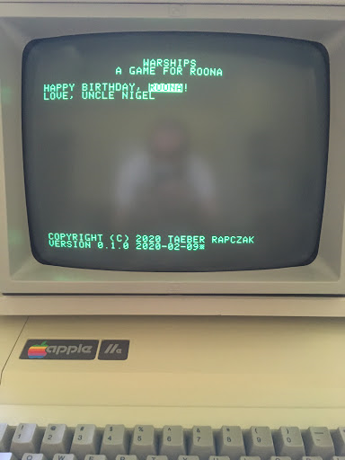
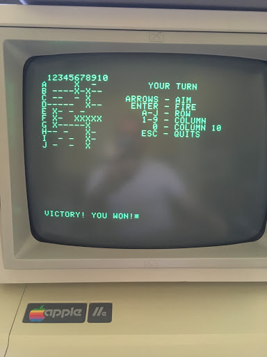

# Warships

_A Game for Roona_

## About

This is the first game I wrote for the Apple //e. It's a Battleship-type game
for my niece.

I wrote it in 6502 assembly and assembled it using
[a2asm](https://github.com/taeber/a2asm), which I also wrote for this project.


## Quickstart

To assemble, simply run:

```bash
$ make
```

You can then take the resulting `build/warships.a2` binary, load it onto
your Apple //e however you know how to, then run:

```
] BRUN WARSHIPS
```

Alternatively, you could run:

```bash
$ make all
```

This produces a DOS 3.3 .DSK file with the binary file on it called `WARSHIPS`.
Load it using your favorite Apple2 emulator like
[Apple2JS](https://www.scullinsteel.com/apple2/),
[LinApple](https://github.com/linappleii/linapple), or
[AppleWin](https://github.com/AppleWin/AppleWin).


It also produces a .WAV file that you can load using the instructions printed
to the screen after `make all` finishes.


## Screenshots

_Intro Screen_




_Victory Screen_


